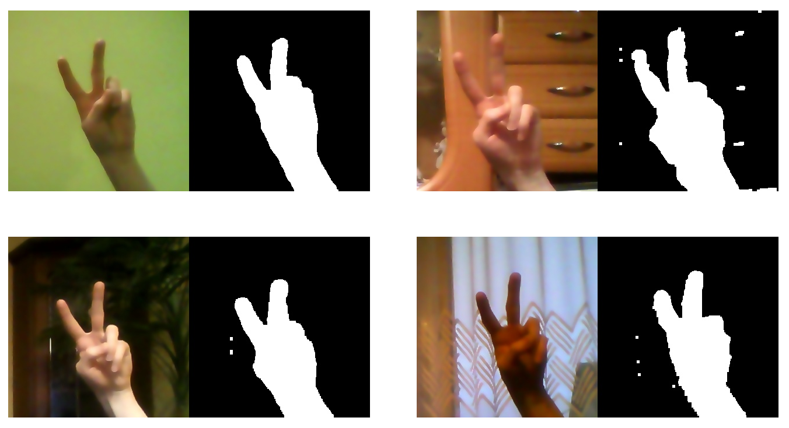

# Hand Gesture Control

It is a program that recognizes hand gestures shown to the webcam. Each frame is subjected to the process of creating a hand mask, which is then given as the input of a learned neural network to predict result. Therefore, it is possible to control the video player by perform the appropriate gestures.

## Demo

### Hand gesture recognition

  

### Controlling video player

  

### Hand masks generated in various conditions

  

## Getting Started

These instructions will get you a copy of the project up and running on your local machine for development and testing purposes. See deployment for notes on how to deploy the project on a live system.

### Hardware  
The project has been written in such a way that it runs smoothly on a computer with average components.  
My computer's specifications:  
* 0.3 MP webcam  
* Intel Core i7-3610QM  
* NVIDIA GeForce GT 630M
* 8 GB RAM

### Prerequisites

1. Webcam
2. VLC media player
3. Python 3
```
sudo apt-get update
sudo apt-get upgrade
sudo apt-get install python3.6
sudo apt-get install python3-pip
```

### Installing

Install the necessary dependencies:  
```
pip3 install -r requirements.txt
```

## Deployment

Install BLAS library:
```
sudo apt-get install build-essential cmake git unzip pkg-config libopenblas-dev liblapack-dev
```
Install HDF5 library:
```
sudo apt-get install libhdf5-serial-dev python3-h5py
```

In addition, you can install CUDA drivers and the cuDNN toolkit. Remember that your graphics card must support CUDA.
1. CUDA - https://developer.nvidia.com/cuda-downloads  
2. cuDNN - https://developer.nvidia.com/cudnn  


## Built With

* [Python 3](https://docs.python.org/3/) - The programming language
* [TensorFlow](https://www.tensorflow.org/api_docs/python/) - A end-to-end open source platform for machine learning 
* [Keras](https://keras.io/documentation/) - A high-level neural networks API written in Python
* [OpenCV](https://docs.opencv.org/4.1.1/d6/d00/tutorial_py_root.html) - Computer vision and machine learning software library
* [NumPy](https://numpy.org/doc/1.17/) - The package for scientific computing with Python
* [OpenBLAS](https://github.com/xianyi/OpenBLAS/wiki) - An optimized BLAS library (Basic Linear Algebra Subprogram)
* [pynput](https://pynput.readthedocs.io/en/latest/) - This library allows control and monitor input devices
* [h5py](https://docs.h5py.org/en/stable/) - The package is a Pythonic interface to the HDF5 binary data format
* [os](https://docs.python.org/3/library/os.html) - This module provides a portable way of using operating system dependent functionality

## Authors

* **Tomasz Strzoda** - [DrDEXT3R](https://github.com/DrDEXT3R)

## License

This project is licensed under the GNU General Public License v3.0 - see the [LICENSE](https://github.com/DrDEXT3R/HandGestureControl/blob/master/LICENSE) file for details.
